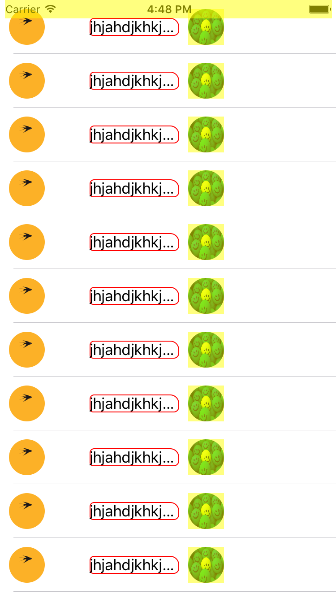

# LATClip

* 一套圆角视图裁剪的组件，消除离屏渲染问题。

### 【演示】 

### 【功能】

* 图片的圆角、任意圆角裁剪
* 视图的圆角、任意圆角的裁剪

### 【使用】

* 引入头文件：LATClipHeader.h


* 图片的裁剪

  * 圆形图片的裁剪

    ```objective-c
    /**
     *  @author Later, 16-06-01 15:06
     *
     *  获取圆形图片
     *
     *  @param rect 图片的rect
     *
     *  @return 圆形图片
     */
    - (UIImage *)clipToRountImageWithRect:(CGRect)rect;
    /**
     *  @author Later, 16-06-01 15:06
     *
     *  获取带有边框的圆形图片
     *
     *  @param rect        图片rect
     *  @param borderWidth 边框大小
     *  @param borderColor 边框颜色
     *  @param fillColor   填充色
     *
     *  @return
     */
    - (UIImage *)clipToRountImageWithRect:(CGRect)rect
                              borderWidth:(CGFloat)borderWidth
                              borderColor:(UIColor *)borderColor
                                fillColor:(UIColor *)fillColor;
    ```

  * 任意角切成圆角

    ```objective-c
    /**
     *  @author Later, 16-06-01 15:06
     *
     *  获取一个切角的图片
     *
     *  @param rect             图片rect
     *  @param corner           切脚类型
     *  @param cornerRadiusSize 圆角尺度
     *
     *  @return
     */
    - (UIImage *)clipImageWithRect:(CGRect)rect
                           corners:(UIRectCorner)corner
                  cornerRadiusSize:(CGSize)cornerRadiusSize;
    /**
     *  @author Later, 16-06-01 15:06
     *
     *  获取一个带有边框和填充色的切角图片
     *
     *  @param rect              图片rect
     *  @param borderWidth       边框大小
     *  @param borderColor       边框颜色
     *  @param fillColor         填充颜色
     *  @param viewContentMode   填充样式
     *  @param corner            切角类型
     *  @param cornerRadiusSize  切角尺寸
     *
     *  @return
     */
    - (UIImage *)clipImageWithRect:(CGRect)rect
                       borderWidth:(CGFloat)borderWidth
                       borderColor:(UIColor *)borderColor
                         fillColor:(UIColor *)fillColor
                   viewContentMode:(UIViewContentMode)viewContentMode
                           corners:(UIRectCorner)corners
                  cornerRadiusSize:(CGSize)cornerRadiusSize;
    ```

  * 按path进行切图

    ```objective-c
    /**
     *  @author Later, 16-06-01 15:06
     *
     *  获取一个路径下的切角图片
     *
     *  @param rect              图片rect
     *  @param borderWidth       边框尺寸
     *  @param borderColor       边框颜色
     *  @param fillColor         填充色
     *  @param viewContentMode   填充样式
     *  @param path              路径
     *
     *  @return 
     */
    - (UIImage *)clipImageWithRect:(CGRect)rect
                       borderWidth:(CGFloat)borderWidth
                       borderColor:(UIColor *)borderColor
                         fillColor:(UIColor *)fillColor
                   viewContentMode:(UIViewContentMode)viewContentMode
                              path:(CGPathRef)path;
    ```

  * 不同的角切不同半径的圆角

    ```objective-c
    /**
     *  @author Later, 16-06-02 10:06
     *
     *  按不同的角来切图
     *
     *  @param rect         rect
     *  @param cornerRadius cornerRadius
     *
     *  @return
     */
    - (UIImage *)clipImageWithRect:(CGRect)rect
                      cornerRadius:(LATRadius)cornerRadius;
    /**
     *  @author Later, 16-06-02 10:06
     *
     *  按不同的角度来切图
     *
     *  @param rect            rect
     *  @param cornerRadius    角度
     *  @param borderWidth     边框宽
     *  @param borderColor     边框颜色
     *  @param viewContentMode 视图填充演示
     *
     *  @return 
     */
    - (UIImage *)clipImageWithRect:(CGRect)rect
                      cornerRadius:(LATRadius)cornerRadius
                       borderWidth:(CGFloat)borderWidth
                       borderColor:(UIColor *)borderColor
                   viewContentMode:(UIViewContentMode)viewContentMode;
    ```

* 视图的切角

  * 圆形

    ```objective-c
    #pragma mark 圆形图
    - (void)clipToRountWithBackgroundColor:(UIColor *)backgroundColor;

    - (void)clipToRountWithBackgroundImage:(UIImage *)backgroundImage;

    - (void)clipToRountWithBackgroundColor:(UIColor *)backgroundColor
                           viewContentMode:(UIViewContentMode)viewContentMode;

    - (void)clipToRountWithBackgroundImage:(UIImage *)backgroundImage
                           viewContentMode:(UIViewContentMode)viewContentMode;

    - (void)clipToRountWithBorderWidth:(CGFloat)borderWidth
                           borderColor:(UIColor *)borderColor
                       backgroundColor:(UIColor *)backgroundColor
                       viewContentMode:(UIViewContentMode)viewContentMode;

    - (void)clipToRountWithBorderWidth:(CGFloat)borderWidth
                           borderColor:(UIColor *)borderColor
                       backgroundImage:(UIImage *)backgroundImage
                       viewContentMode:(UIViewContentMode)viewContentMode;

    - (void)clipToRountWithBorderWidth:(CGFloat)borderWidth
                           borderColor:(UIColor *)borderColor
                       backgroundImage:(UIImage *)backgroundImage
                       backgroundColor:(UIColor *)backgroundColor
                       viewContentMode:(UIViewContentMode)viewContentMode;
    ```

  * 切四个角的某几个角，且切角半径相同的

    ```objective-c
    #pragma mark 不规则四角切图
    - (void)clipWithCorners:(UIRectCorner)corners
           cornerRadiusSize:(CGSize)cornerRadiusSize
            backgroundImage:(UIImage *)backgroundImage;

    - (void)clipWithCorners:(UIRectCorner)corners
           cornerRadiusSize:(CGSize)cornerRadiusSize
            backgroundColor:(UIColor *)backgroundColor;

    - (void)clipWithCorners:(UIRectCorner)corners
           cornerRadiusSize:(CGSize)cornerRadiusSize
            backgroundImage:(UIImage *)backgroundImage
            viewContentMode:(UIViewContentMode)viewContentMode;

    - (void)clipWithCorners:(UIRectCorner)corners
           cornerRadiusSize:(CGSize)cornerRadiusSize
            backgroundColor:(UIColor *)backgroundColor
            viewContentMode:(UIViewContentMode)viewContentMode;

    - (void)clipWithCorners:(UIRectCorner)corners
           cornerRadiusSize:(CGSize)cornerRadiusSize
                borderWidth:(CGFloat)borderWidth
                borderColor:(UIColor *)borderColor
            backgroundImage:(UIImage *)backgroundImage;

    - (void)clipWithCorners:(UIRectCorner)corners
           cornerRadiusSize:(CGSize)cornerRadiusSize
                borderWidth:(CGFloat)borderWidth
                borderColor:(UIColor *)borderColor
            backgroundColor:(UIColor *)backgroundColor;

    - (void)clipWithCorners:(UIRectCorner)corners
           cornerRadiusSize:(CGSize)cornerRadiusSize
                borderWidth:(CGFloat)borderWidth
                borderColor:(UIColor *)borderColor
            backgroundImage:(UIImage *)backgroundImage
            viewContentMode:(UIViewContentMode)viewContentMode;

    - (void)clipWithCorners:(UIRectCorner)corners
           cornerRadiusSize:(CGSize)cornerRadiusSize
                borderWidth:(CGFloat)borderWidth
                borderColor:(UIColor *)borderColor
            backgroundColor:(UIColor *)backgroundColor
            viewContentMode:(UIViewContentMode)viewContentMode;

    - (void)clipWithCorners:(UIRectCorner)corners
           cornerRadiusSize:(CGSize)cornerRadiusSize
                borderWidth:(CGFloat)borderWidth
                borderColor:(UIColor *)borderColor
            backgroundImage:(UIImage *)backgroundImage
            backgroundColor:(UIColor *)backgroundColor
            viewContentMode:(UIViewContentMode)viewContentMode;
    ```

  * 按path切角

    ```objective-c
    - (void)clipedWithBorderWidth:(CGFloat)borderWidth
                      borderColor:(UIColor *)borderColor
                  backgroundImage:(UIImage *)backgroundImage
                  backgroundColor:(UIColor *)backgroundColor
                  viewContentMode:(UIViewContentMode)viewContentMode
                             path:(CGPathRef)path;
    ```

  * 裁切不同角度半径的切图

    ```objective-c
    #pragma mark 根据传入裁切半径裁切视图
    - (void)clipWithCornerRadius:(LATRadius)cornerRadius
                 backgroundColor:(UIColor *)backgroundColor;

    - (void)clipWithCornerRadius:(LATRadius)cornerRadius
                 backgroundImage:(UIImage *)backgroundImage;

    - (void)clipWithCornerRadius:(LATRadius)cornerRadius
                 backgroundImage:(UIImage *)backgroundImage
                 viewContentMode:(UIViewContentMode)viewContentMode;

    - (void)clipWithCornerRadius:(LATRadius)cornerRadius
                 backgroundColor:(UIColor *)backgroundColor
                 viewContentMode:(UIViewContentMode)viewContentMode;

    - (void)clipWithCornerRadius:(LATRadius)cornerRadius
                     borderWidth:(CGFloat)borderWidth
                     borderColor:(UIColor *)borderColor
                 backgroundImage:(UIImage *)backgroundImage;

    - (void)clipWithCornerRadius:(LATRadius)cornerRadius
                     borderWidth:(CGFloat)borderWidth
                     borderColor:(UIColor *)borderColor
                 backgroundColor:(UIColor *)backgroundColor;

    - (void)clipWithCornerRadius:(LATRadius)cornerRadius
                     borderWidth:(CGFloat)borderWidth
                     borderColor:(UIColor *)borderColor
                 backgroundImage:(UIImage *)backgroundImage
                 viewContentMode:(UIViewContentMode)viewContentMode;

    - (void)clipWithCornerRadius:(LATRadius)cornerRadius
                     borderWidth:(CGFloat)borderWidth
                     borderColor:(UIColor *)borderColor
                 backgroundColor:(UIColor *)backgroundColor
                 viewContentMode:(UIViewContentMode)viewContentMode;

    - (void)clipWithCornerRadius:(LATRadius)cornerRadius
                     borderWidth:(CGFloat)borderWidth
                     borderColor:(UIColor *)borderColor
                 backgroundImage:(UIImage *)backgroundImage
                 backgroundColor:(UIColor *)backgroundColor
                 viewContentMode:(UIViewContentMode)viewContentMode;
    ```

### 【优缺点】

#### 优点

* 相对于使用`self.clipToBounds = YES`的方式，不会引起离屏渲染。
* 视图裁切方式多样，方法多样满足不同需求。

#### 缺点

* 仅满足最多四个角的切角，不适用于多边形的切图。

